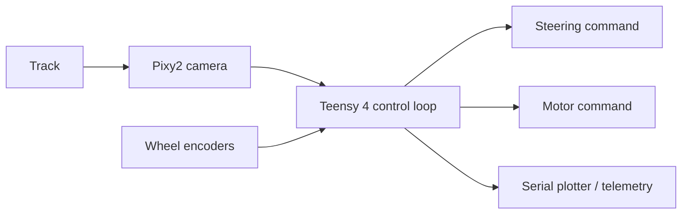

# NXP Cup 2025 — Autonomous Lane-Following Car

Embedded software and engineering documentation for an autonomous NXP Cup vehicle built around a Teensy 4, Pixy2 camera, wheel encoders, and closed-loop motor control.

## Results

- 1st place — NXP Cup Tunisia
- Only Tunisian team qualified for the 2025 international finals
- International finalist — Netherlands, May 2025

## What the car does

The vehicle reads the track through a Pixy2 camera, estimates the lane error, and corrects its trajectory in real time. Encoder feedback closes the motor-speed loop so steering and velocity can be tuned independently and tested repeatably.



## Hardware

| Component | Role |
|---|---|
| Teensy 4.0 | Main real-time controller |
| Pixy2 | Lane and line detection |
| JGA25-371 motors | Vehicle propulsion |
| Wheel encoders | Speed feedback |
| Steering servo | Trajectory correction |
| 3S LiPo battery | Power source |

See [HARDWARE_DOCUMENTATION.md](HARDWARE_DOCUMENTATION.md) for mechanical, electronic, and competition lessons.

## Software architecture

The firmware is a PlatformIO/Arduino project. `src/main.cpp` contains the competition control loop, while the serial-plotting module exposes internal signals for tuning and validation.

```text
NXP-CUP-FINALS/
├── src/
│   ├── main.cpp                 # Vehicle control loop
│   └── Serial_Plotting.cpp      # Telemetry output
├── include/
│   └── Serial_Plotting.h
├── test/                        # Experimental/test firmware
├── Serial_Plotter.py            # Desktop plotting utility
├── HARDWARE_DOCUMENTATION.md
└── platformio.ini
```

## Control pipeline

1. Capture the lane position from Pixy2.
2. Convert visual displacement into a steering error.
3. Apply PID correction to stabilize the trajectory.
4. Read encoder feedback for motor-speed regulation.
5. Drive the motor and steering outputs.
6. Stream selected signals over serial for tuning and debugging.

Lighting, camera exposure, lens position, vehicle speed, tire grip, and track geometry all affect the controller. Tune on the real competition surface whenever possible.

## Build and upload

### Requirements

- PlatformIO CLI or the PlatformIO VS Code extension
- Teensy 4.0 connected over USB
- Pixy2 library, installed automatically from `platformio.ini`

```bash
git clone https://github.com/aminebensaid66/NXP-CUP-FINALS.git
cd NXP-CUP-FINALS
pio run
pio run --target upload
```

Open a serial monitor with:

```bash
pio device monitor
```

## Tuning and validation

- Begin at a low target speed.
- Validate camera detection before enabling motors.
- Tune proportional response first, then damping, then integral correction if needed.
- Inspect encoder and error signals using `Serial_Plotter.py`.
- Recalibrate Pixy2 after major lighting or camera-position changes.
- Test failure behavior when the lane temporarily disappears.

## Engineering lessons

- Mechanical alignment matters as much as controller tuning.
- A modular, soldered PCB is more reliable than temporary competition wiring.
- Debug telemetry and a manual override dramatically reduce track-testing time.
- Early testing is essential because accumulated lane error becomes difficult to recover at speed.
- Clear ownership across mechanics, electronics, embedded software, and testing prevents duplicated work.

## Additional resources

- [Hardware and competition documentation](HARDWARE_DOCUMENTATION.md)
- [NXP Cup information-session presentation](nxp_cup_presentation.pdf)
- `mechanical design/` contains competition rules and retained mechanical artifacts

## Team

Built collaboratively by the INSAT/AEROBOTIX team representing Tunisia. Consult the Git history and project documentation for individual contributions.

## License and third-party material

No blanket license is currently granted for the repository. Competition rules, books, archived designs, and other third-party files remain subject to their original licenses and copyrights. Consider removing large third-party artifacts from future revisions and linking to their official sources instead.
